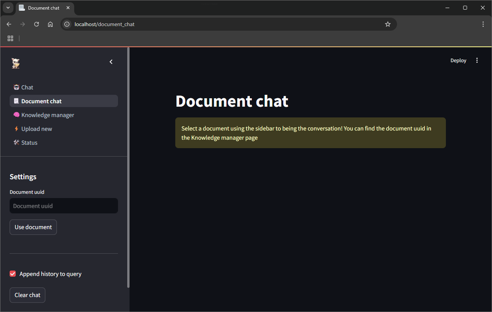
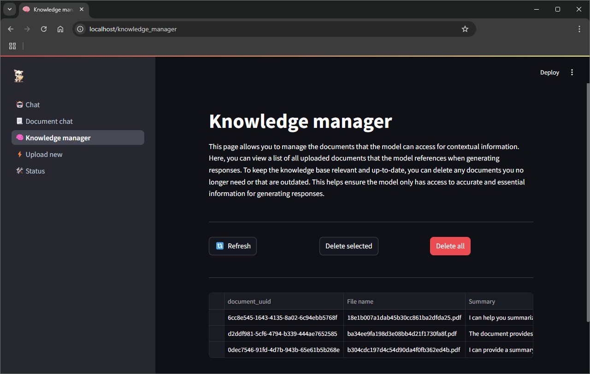
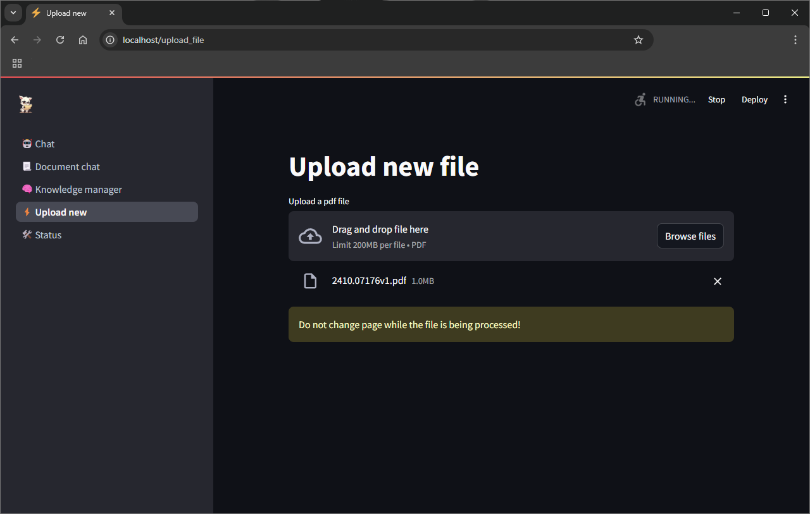
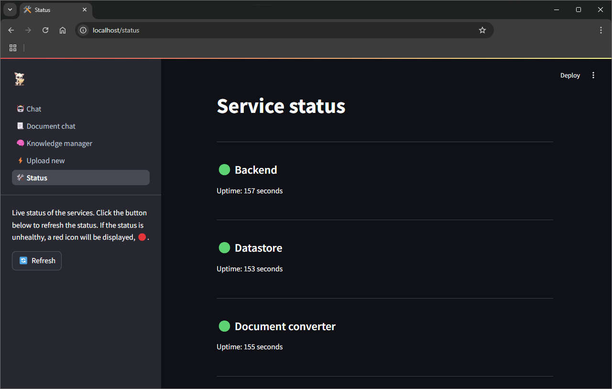

<div id="top"></div>
<br/>
<br/>
<br/>


<p align="center">
  
</p>
<h1 align="center">
    <a href="https://github.com/Armaggheddon/PaperLlama">PaperLlama</a>
</h1>
<p align="center">
    <a href="https://github.com/Armaggheddon/PaperLlama/commits/master">
    
    </a>
    <a href="https://github.com/Armaggheddon/PaperLlama">
    
    </a>
    <a href="https://github.com/Armaggheddon/PaperLlama/issues">
    
    </a>
    <a href="https://github.com/Armaggheddon/PaperLlama/blob/master/LICENSE">
    
    </a>
</p>
<p align="center">
    Your fully local, AI-powered Q&A assistant—meet PaperLlama!
    <br/>
    <br/>
    <a href="https://github.com/Armaggheddon/PaperLlama/issues">Report Bug</a>
    •
    <a href="https://github.com/Armaggheddon/PaperLlama/issues">Request Feature</a>
</p>

---

Welcome to **PaperLlama**! 🦙🎓 Your personal academic assistant that’s powered up and ready to help you sift through stacks of papers, PDFs, and academic docs for those *must-have* insights! Using a combo of state-of-the-art AI magic (thanks to Ollama's wide model support) and custom-built tech, PaperLlama makes document-based Q&A a breeze.


## 🚀 Getting Started
With **Docker Compose**, you can spin up the whole PaperLlama suite in one go! Here's how:
1. Clone the repository:
    ```bash
    git clone https://github.com/Armaggheddon/PaperLlama.git
    cd PaperLlama
    ```

1. Chose either the `docker-compose.yml` for cpu-only setups or `gpu-docker-compose.yml` if you have an Nvidia GPU. First build and then launch the containers with
    ```bash
    docker compose -f <compose_file> build
    docker compose -f <compose_file> up -d
    ```

1. Once everything's up, navigate to `http://localhost:80` to start using PaperLlama through the web ui. 

1. Start Exploring! Upload a PDF, ask a question, and let PaperLlama pull the info you need in seconds!

> [!NOTE]
> GPU support requires the NVIDIA Container Toolkit. Look [here](https://docs.nvidia.com/datacenter/cloud-native/container-toolkit/latest/install-guide.html) for the installation guide.

> [!IMPORTANT]
> The first startup, as well as the first file upload, might take a while since the required models are downloaded. This is a one time operation. 


## 🖼️ User Interface Overview
Here's a quick tour of what's on the PaperLlama dashboard!

### 🤖 Chat
The heart of PaperLlama! Ask questions directly here, and get answers powered by your uploaded documents. Perfect for digging into those long reports and finding what you need fast. This page pulls data from all the uploaded files. 
<p align="center">
  
</p>

### 📃 Document chat
Select a document and chat exclusively with its contents. This mode only queries data from the selected document uuid (which can be found in the knowledge manager)
<p align="center">
  
</p>

### 🧠 Knowledge Manager
This page is your overview of everything PaperLlama has indexed. You’ll see all the uploaded documents, metadata, and the data that can be used for generating answers.
<p align="center">
  
</p>

### ⚡ Upload new
Got more PDFs? Head here to add them to PaperLlama. Each upload is automatically embedded and indexed so it’s ready for action. If is the first time uploading a file, it might take a while due to the models being downloaded. Go take a coffee or think about that bug you introduced last friday 🤔.
<p align="center">
  
</p>

> [!NOTE]
> For now, we only support PDFs. But we’re always working on expanding to more document types! 📄✨

### 🛠️ Status
See the current status of the services that allow PaperLlama to work. Hopefully everything is 🟢. 😁
<p align="center">
  
</p>


## 🎨 Customization
Chose which model to use for the document summarization, chat and embedding. By default the following models are used. However feel free to try different ones by setting the following environment variables in the docker compose file:
```dockerfile
environment:
    - EMBEDDING_MODEL_NAME=nomic-embed-text
    - EMBEDDING_MODEL_OUTPUT_SIZE=768
    - CHAT_MODEL_NAME=llama3.2:1b
    - INSTRUCT_MODEL_NAME=llama3.2:1b-instruct-q4_0
```

You can use any model that Ollama supports, assuming it can run on your hardware 🫣. Look [**here**](https://ollama.com/search) for a complete list of supported models.

> [!WARNING]
> When you change the text embedding model and there are already embedded documents, if the embedding size is different, this will crash the application. Delete the currently stored documents and restart.

Additionally, free to change the prompts used in [prompts.py](../backend/src/ollama_proxy/prompts.py) to better match the model you choose to use.

## 🧐 How it works?
PaperLlama is designed to provide a seamless experience for managing and querying documents. At a high level, the project consists of several services that work together to handle different aspects of the application. Each service exposes their functionality through a FastAPI web server so that you can easily swap components for the ones you prefer. Don't like the **datastore** and prefer ChromaDB? Simply change the **datastore** service implementing the same API interface as **datastore** and you are all ready to go!. 


Here’s a brief overview of how the project works and the main services involved:

- **web_ui**: handles the web interface.

- **backend**: this is the main service that orchestrates the interaction between different services, effectively acting as a proxy for **datastore** and **document_converter**.

- **datastore**: this service is responsible for storing and managing all the data used by PaperLlama.

- **document_converter**: handles the document conversion from PDF format to markdown so that it easily understood by the AI model used.

This compartimentation of the different services allows for easy swapping and customization of its core components. Just make sure the API interface is the same!

API specifics can be found here:
- [**backend**](API_BACKEND.md)
- [**datastore**](API_DATASTORE.md)
- [**document_converter**](API_DOCUMENT_CONVERTER.md)


## 📮 Responsible Disclosure
 We assume no responsibility for an improper use of this code and everything related to it. We do not assume any responsibility for damage caused to people and / or objects in the use of the code.

**By using this code even in a small part, the developers are declined from any responsibility.**

 More informations is available at the following link: [**License**](../LICENSE)


## 🐛 Bug and Feature 
To **report a bug** or to request the implementation of **new features**, it is strongly recommended to use the [**ISSUES tool from Github »**](https://github.com/Armaggheddon/PaperLlama/issues).

Here you may already find the answer to the problem you have encountered, in case it has already happened to other people. Otherwise you can report the bugs found.

**ATTENTION: To speed up the resolution of problems, it is recommended to answer all the questions present in the request phase in an exhaustive manner.**

(Even in the phase of requests for the implementation of new functions, we ask you to better specify the reasons for the request and what final result you want to obtain).


## 🔍 License
**MIT LICENSE**

*Permission is hereby granted, free of charge, to any person obtaining a copy
of this software and associated documentation files (the "Software"), to deal
in the Software without restriction, including...*


[**License Documentation »**](../LICENSE)


## 📚 Libraries used
This project makes use of the following third party libraries:
- [**Ollama**](https://ollama.com/): for the LLM inference.
- [**FastAPI**](https://fastapi.tiangolo.com/): for the webserver of each of the service.
- [**Faiss**](https://github.com/facebookresearch/faiss): for the vector database.
- [**Docling**](https://github.com/DS4SD/docling): for processing the PDF files in such a way that is easily understandable by AI models.
- [**Streamlit**](https://streamlit.io/): for the web ui.
