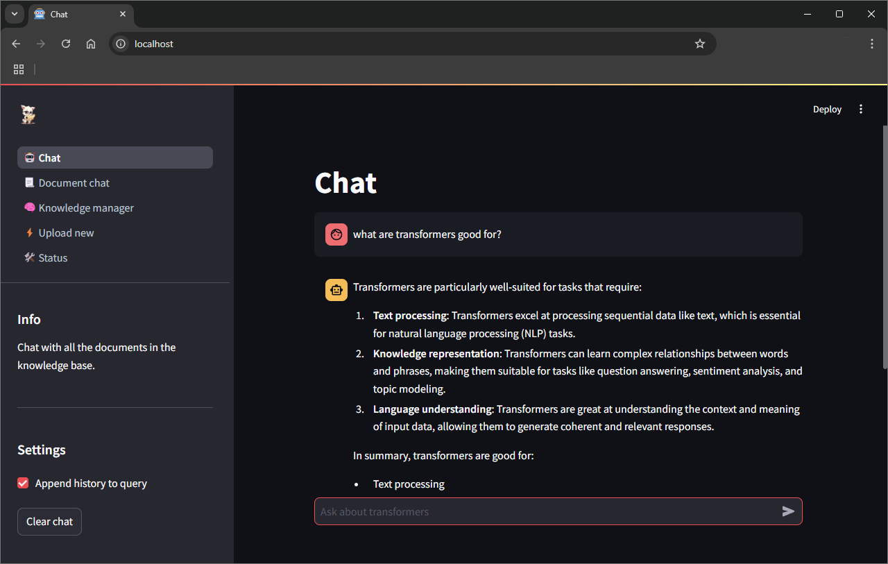

<div id="top"></div>
<br/>
<br/>
<br/>


<p align="center">
  
</p>
<h1 align="center">
    <a href="https://github.com/Armaggheddon/PaperLlama">PaperLlama</a>
</h1>
<p align="center">
    <a href="https://github.com/Armaggheddon/PaperLlama/commits/master">
    
    </a>
    <a href="https://github.com/Armaggheddon/PaperLlama">
    
    </a>
    <a href="https://github.com/Armaggheddon/PaperLlama/issues">
    
    </a>
    <a href="https://github.com/Armaggheddon/PaperLlama/blob/master/LICENSE">
    
    </a>
</p>
<p align="center">
    Your fully local, AI-powered Q&A assistant—meet PaperLlama!
    <br/>
    <br/>
    <a href="https://github.com/Armaggheddon/PaperLlama/issues">Report Bug</a>
    •
    <a href="https://github.com/Armaggheddon/PaperLlama/issues">Request Feature</a>
</p>

---

Welcome to **PaperLlama**! 🦙🎓 Your personal academic assistant that’s powered up and ready to help you sift through stacks of papers, PDFs, and academic docs for those *must-have* insights! Using a combo of state-of-the-art AI magic (thanks to Ollama's wide model support) and custom-built tech, PaperLlama makes document-based Q&A a breeze.


## 🚀 Getting Started
With **Docker Compose**, you can spin up the whole PaperLlama suite in one go! Here's how:
1. Clone the repository:
    ```bash
    git clone https://github.com/Armaggheddon/PaperLlama.git
    cd PaperLlama
    ```

1. Chose either the `docker-compose.yml` for cpu-only setups or `gpu-docker-compose.yml` if you have an Nvidia GPU. First build and then launch the containers with
    ```bash
    docker compose -f <compose_file> build
    docker compose -f <compose_file> up -d
    ```

1. Once everything's up, navigate to `http://localhost:80` to start using PaperLlama through the web ui. 

1. Start Exploring! Upload a PDF, ask a question, and let PaperLlama pull the info you need in seconds!

> [!NOTE]
> GPU support requires the NVIDIA Container Toolkit. Look [here](https://docs.nvidia.com/datacenter/cloud-native/container-toolkit/latest/install-guide.html) for the installation guide.

> [!IMPORTANT]
> The first startup, as well as the first file upload, might take a while since the required models are downloaded. This is a one time operation. 


## 🖼️ User Interface Overview
Here's a quick tour of what's on the PaperLlama dashboard!

### 🤖 Chat
The heart of PaperLlama! Ask questions directly here, and get answers powered by your uploaded documents. Perfect for digging into those long reports and finding what you need fast. This page pulls data from all the uploaded files. 
<p align="center">
  
</p>

### 📃 Document chat
Select a document and chat exclusively with its contents. This mode only queries data from the selected document uuid (which can be found in the knowledge manager)
<p align="center">
  
</p>

### 🧠 Knowledge Manager
This page is your overview of everything PaperLlama has indexed. You’ll see all the uploaded documents, metadata, and the data that can be used for generating answers.
<p align="center">
  
</p>

### ⚡ Upload new
Got more PDFs? Head here to add them to PaperLlama. Each upload is automatically embedded and indexed so it’s ready for action. If is the first time uploading a file, it might take a while due to the models being downloaded. Go take a coffee or think about that bug you introduced last friday 🤔.
<p align="center">
  
</p>

> [!NOTE]
> For now, we only support PDFs. But we’re always working on expanding to more document types! 📄✨

### 🛠️ Status
See the current status of the services that allow PaperLlama to work. Hopefully everything is 🟢. 😁
<p align="center">
  
</p>


## 🎨 Customization
Chose which model to use for the document summarization, chat and embedding. By default the following models are used. However feel free to try different ones by setting the following environment variables in the docker compose file:
```dockerfile
environment:
    - EMBEDDING_MODEL_NAME=nomic-embed-text
    - EMBEDDING_MODEL_OUTPUT_SIZE=768
    - CHAT_MODEL_NAME=llama3.2:1b
    - INSTRUCT_MODEL_NAME=llama3.2:1b-instruct-q4_0
```

You can use any model that is supported by Ollama, assuming it can run on your hardware 🫣. Look [**here**](https://ollama.com/search) for a complete list of supported models.

The prompts used for the different tasks are not the greatest, I will give that. So feel free to change the prompts used in [`prompts.py`](../backend/src/ollama_proxy/prompts.py) to better match the model you choose to use. Remember to rerun [`Step 2 of Getting started`](#-getting-started) if the prompts are changed while the services are running.

> [!NOTE]
> Using Llama 3.2 1B, while being lightweight to run, will not yield the best results. Try with a larger model since it generally has better understanding capabilities and adherence to the prompts.

> [!WARNING]
> When you change the text embedding model and there are already embedded documents, if the embedding size is different, querying or adding new documents will crash the application. Delete the currently stored documents and restart.


## 🧐 How it works?
PaperLlama is a project born from a desire to experiment with LLMs and RAG systems. The goal was to create a straightforward implementation that balances simplicity with flexibility, allowing users to easily understand the system while also enabling them to swap components of customize the pipeline to fit their needs.

At its core, PaperLlama provides a seamless experience for managing and querying documents by organizing its functionality into modular services. Each service exposes its functionality through a FastAPI web server, making it easy to replace or extend components as long as they adhere to the same API interface.

The **datastore** is built using Faiss and SQLite, and I considered it as a personal excercise. If you prefer other vector indexes, which might also provide more functionalities you can simply replace it! There are many open source alternatives, for example you prefer ChromaDB? No problem! Replace the **datastore** service with one that implements the same API interface, and you're good to go.

Here’s a brief overview of how the project works and the main services involved:

- **web_ui**: handles the user-facing web interface, providing a way to interact with the system.

- **backend**: the main service that orchestrates the interaction between different services, effectively acting as a proxy for **datastore** and **document_converter**.

- **datastore**: manages data storage and retrieval, including document metadata and vector embeddings.

- **document_converter**: converts PDF documents into a markdown format that can be easily processed by the AI model.

This modular approach ensures flexibility, enabling experimentation with different LLMs, storage systems, or workflows. By keeping the design minimal yet extensible, PaperLlama is an ideal playground for anyone curious about building RAG pipelines or exploring document-based AI applications.

For details on API specifications, refer to:
- [**backend**](API_BACKEND.md)
- [**datastore**](API_DATASTORE.md)
- [**document_converter**](API_DOCUMENT_CONVERTER.md)


## 🛠️ Development
If you’re working on PaperLlama and want to focus on developing or debugging a specific service, you can enable individual services by modifying the provided [`dev-docker-compose.yml`](../dev-docker-compose.yml) file. Here’s how you can adjust the Compose file for development purposes:

1. For each service you want to to work with uncomment the following lines 
    ```yaml
      stdin_open: true
      tty: true
      command:
        - /bin/bash
    ```

1. Launch the containers:
    ```bash
    docker compose -f dev-docker-compose.yml up
    ```

1. Connect to the container/s that you want to develop with. A development folder will be mounted at `/dev_<service_name>` where `<service_name>` is the name of the service you are currently connected to; for example for the datastore will be `/dev_datastore`. All the changes made to the contents of this folder will be reflected on the host `/<service_name>` folder.

1. Once you finished simply terminate the containers with either `ctrl+c` or:
    ```bash
    docker compose -f dev-docker-compose down
    ```
    add option `-v` to also clear the volumes. This will also cause the services to redownload all the models on the next startup.

1. Chose between `gpu-docker-compose.yml` or `docker-compose.yml` and run:
    ```bash
    docker compose -f <compose_file> build
    docker compose -f <compose_file> up -d
    ```

> [!WARNING]
> The `dev-docker-compose.yml` assumes that the host has an Nvidia GPU. If this is not the case, simply remove the following lines from the services `ollama` and `document_converter`:
>```yaml
>    deploy:
>    resources:
>        reservations:
>        devices:
>            -driver: nvidia
>            count: 1
>            capabilities: [gpu]
>```

> [!NOTE]
> When using `dev-docker-compose.yml` all the services will expose the OpenAPI documentation on the following ports:
>- backend: `http://localhost:8100/docs`
>- datastore: `http://localhost:8102/docs`
>- document_converter: `http://localhost:8101/docs`

## 📮 Responsible Disclosure
 We assume no responsibility for an improper use of this code and everything related to it. We do not assume any responsibility for damage caused to people and / or objects in the use of the code.

**By using this code even in a small part, the developers are declined from any responsibility.**

 More informations is available at the following link: [**License**](../LICENSE)


## 🐛 Bug and Feature 
To **report a bug** or to request the implementation of **new features**, it is strongly recommended to use the [**ISSUES tool from Github »**](https://github.com/Armaggheddon/PaperLlama/issues).

Here you may already find the answer to the problem you have encountered, in case it has already happened to other people. Otherwise you can report the bugs found.

**ATTENTION: To speed up the resolution of problems, it is recommended to answer all the questions present in the request phase in an exhaustive manner.**

(Even in the phase of requests for the implementation of new functions, we ask you to better specify the reasons for the request and what final result you want to obtain).


## 🔍 License
**MIT LICENSE**

*Permission is hereby granted, free of charge, to any person obtaining a copy
of this software and associated documentation files (the "Software"), to deal
in the Software without restriction, including...*


[**License Documentation »**](../LICENSE)


## 📚 Libraries used
This project makes use of the following third party libraries:
- [**Ollama**](https://ollama.com/): for the LLM inference.
- [**FastAPI**](https://fastapi.tiangolo.com/): for the webserver of each service.
- [**Faiss**](https://github.com/facebookresearch/faiss): for the vector database.
- [**Docling**](https://github.com/DS4SD/docling): for processing the PDF files in such a way that is easily understandable by AI models.
- [**Streamlit**](https://streamlit.io/): for the web ui.
